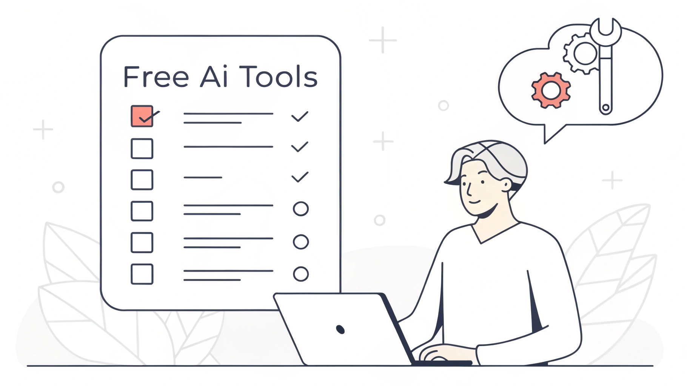

# Herramientas de IA Curadas

> Una lista curada de las mejores herramientas de inteligencia artificial

¡Bienvenido a Free AI Tools! Explora mi lista curada de IA que cubre las mejores herramientas de IA generativa y modelos de lenguaje grandes. Si deseas contribuir con contenido o mostrar tu producto, ¡siéntete libre de enviar un PR a este repositorio—completamente gratis! Únete a mi lista de productos de IA en constante expansión y mantente a la vanguardia de la innovación.

**Languages:** [English](index.md) | [Español](index.es.md) | [Português](index.pt.md) | [中文](index.zh.md)

## Tabla de Contenidos

- [🌟 Selección del Editor](#editors-choice)
- [📝 IA de Texto](#text)
  - [Modelos](#modelos)
  - [Chatbots](#chatbots)
  - [Motores de Búsqueda](#search-engines)
  - [Motores de Búsqueda Locales](#local-search-engines)
  - [Asistentes de Escritura](#writing-assistants)
  - [Extensiones de ChatGPT](#chatgpt-extensions)
  - [Herramientas de Productividad](#productivity-tools)
  - [Asistentes de Reuniones](#meeting-assistants)
  - [Herramientas Académicas](#academic-tools)
  - [Soporte al Cliente](#customer-support)
  - [Otros Generadores de Texto](#other-text-generators)
  - [Herramientas para Desarrolladores](#developer-tools)
- [👩‍💻 Programación con IA](#code)
- [🖼️ Imágenes de IA Generativa](#image)
  - [Mejores Herramientas de Imagen IA](#best-ai-image-tools)
  - [Modelos Grandes](#large-models)
  - [Servicios](#services)
  - [Diseño Gráfico](#graphic-design)
  - [Bibliotecas de Imágenes](#image-libraries)
  - [Bibliotecas de Modelos](#model-libraries)
  - [Recursos de Stable Diffusion](#stable-diffusion-resources)
- [📽️ Video de IA Generativa](#video)
  - [Animación](#animation)
- [🎶 Audio de IA Generativa](#audio)
  - [Clonación de Voz IA](#ai-voice-cloning)
  - [Generadores de Música IA](#ai-music-generators)
  - [Voz](#voice)
  - [Música](#music)
- [🎯 Herramientas de Marketing IA](#marketing-ai-tools)
- [📞 Agentes Telefónicos IA](#phone-calls)
  - [Llamadas Telefónicas](#phone-calls)
  - [Voz](#voice-1)
- [🎒 Otras Herramientas de IA](#other)
- [👩‍🏫 Recursos de Aprendizaje](#learning-resources)
  - [Recursos de Aprendizaje](#learning-resources)
  - [Aprendizaje Gratuito de IA](#free-ai-learning)
  - [Extensiones de Plataforma NVIDIA](#nvidia-platform-extensions)
  - [Listas Relacionadas](#related-lists)

## Selección del Editor

- [Easy BG Remover](https://easybgremover.com/): diseña fondos transparentes en cuestión de segundos. Easy BG Remover combina recortes con IA, controles de cambio de tamaño y ajustes preestablecidos de exportación.
- [Herramienta de Creación de Gráficos ](https://achartmaker.com/) - Herramienta de Creación de Gráficos permite generar y admite gráficos circulares, diagramas de flujo, gráficos de barras, gráficos de líneas, gráficos de dispersión, gráficos jerárquicos (árbol), gráficos de nutrición y más tipos de gráficos..
- [Dino Kid](https://dinokid.wiki/) - Guías del juego Dino Kid, códigos, listas de niveles y recursos wiki.
- [My Dino Park](https://mydinopark.org/) - Guías del juego My Dino Park, consejos y recursos.
- [Image Stretcher](https://imagestretcher.com/) - Image Stretcher ofrece un redimensionamiento impulsado por IA que amplía los fondos, preserva los sujetos y prepara los recursos creativos para cada canal.
- [Book Title Generator](https://booktitlegenerators.com/) - Usa IA para sugerir títulos más comercializables para tus libros de ficción o no ficción.
- [There's an AI](https://theresanai.com) - La mejor lista de herramientas de IA.
- [Notion AI](https://affiliate.notion.so/9po6cx7rvdr6-4y5a7) - Haz preguntas y encuentra información en segundos, obtén ayuda para escribir y hacer lluvia de ideas dentro de Notion sin cambiar pestañas del navegador.
- [Eggy Car](https://eggycar.cc/) - Juega a Eggy Car Unblocked gratis online. Conduce con cuidado, mantén el equilibrio y transporta un huevo frágil por terrenos desafiantes sin romperlo.
- [Skills2](https://skills2.net/) - El mejor directorio de habilidades de IA para descubrir y compartir habilidades y prompts impulsados por IA.
- [Electron Dash](https://theelectrondash.com/) - Juega a Electron Dash gratis online. Un endless runner 3D de ritmo rápido ambientado en un túnel espacial brillante con obstáculos de neón y plataformas que se desploman.
- [Sinner Maker](https://sinnermaker.xyz/) - Juega a Sinner Maker gratis online. Crea pecadores, moldea su fe y gestiona una aldea donde las relaciones pueden volverse devoción, rivalidad u obsesión.
- [PixGPT](https://pixgpt.io/) - Generador de infografías con IA que transforma información compleja en infografías profesionales con 21 diseños y 20 estilos en un clic.

## Texto

### Modelos

- [OpenAI API](https://openai.com/api/) - La API de OpenAI proporciona acceso a GPT-3 y GPT-4 para varias tareas de lenguaje natural; también proporciona Codex para convertir lenguaje natural en código.
- [Gopher](https://www.deepmind.com/blog/language-modelling-at-scale-gopher-ethical-considerations-and-retrieval) - El modelo de lenguaje de 280 mil millones de parámetros de DeepMind.
- [OPT](https://huggingface.co/facebook/opt-350m) - Los Transformadores Preentrenados Abiertos (OPT) de Facebook son modelos Transformer preentrenados de solo decodificador. [Anuncio](https://ai.facebook.com/blog/democratizing-access-to-large-scale-language-models-with-opt-175b/). [Generación de texto OPT-175B](https://opt.alpa.ai/) alojado por Alpa.
- [Bloom](https://huggingface.co/docs/transformers/model_doc/bloom) - BLOOM de Hugging Face, similar a GPT-3, entrenado en datos que cubren 46 idiomas y 13 lenguajes de programación. #opensource
- [LLaMA](https://ai.facebook.com/blog/large-language-model-llama-meta-ai/) - El modelo grande fundamental de Meta con 65 mil millones de parámetros. #opensource
- [Llama 2](https://ai.meta.com/llama/) - El próximo modelo de lenguaje grande de código abierto de Meta. #opensource
- [Claude 3](https://claude.ai/) - Chatea con Claude, el asistente de IA de Anthropic.
- [Vicuna-13B](https://lmsys.org/blog/2023-03-30-vicuna/) - Chatbot de código abierto afinado desde LLaMA basado en conversaciones de usuarios recopiladas por ShareGPT.
- [Stable Beluga](https://huggingface.co/stabilityai/StableBeluga1-Delta) - Modelo afinado para LLaMA 65B.
- [Stable Beluga 2](https://huggingface.co/stabilityai/StableBeluga2) - Modelo afinado para LLaMA2 70B.
- [GPT-4o Mini](https://altern.ai/ai/gpt-4o-mini) - Avanzando en la inteligencia rentable.

### Chatbots

- [ChatGPT](https://chatgpt.com) - El modelo de lenguaje grande conversacional de OpenAI.
- [Bing Chat](https://www.bing.com/chat) - Modelo de lenguaje AI conversacional impulsado por Microsoft Bing.
- [Gemini](https://gemini.google.com) - Chatbot experimental de Google basado en el modelo LaMDA.
- [Character.AI](https://character.ai/) - Character.AI te permite crear personajes y chatear con ellos.
- [ChatPDF](https://www.chatpdf.com/) - Chatea con cualquier PDF.
- [ChatSonic](https://writesonic.com/chat) - Asistente impulsado por IA que soporta creación de texto e imágenes.
- [Phind](https://www.phind.com/) - Motor de búsqueda y asistente inteligente para programadores, hace preguntas aclaratorias activamente y navega la web cuando se necesita contexto adicional; ahora tiene extensión para VS Code.
- [Tiledesk](https://tiledesk.com/) - Framework de desarrollo de chatbots sin código de código abierto y soporte LLM, diseña, prueba y despliega flujos en canales en minutos.
- [AICamp](https://aicamp.so/) - Versión de equipo de ChatGPT.
- [Gali Chat](https://www.galichat.com/) - Asistente de soporte IA 24/7 para ayudar a hacer crecer tu negocio.
- [DeepSeek-R1](https://www.deepseek.com) - Asistente de IA versátil de DeepSeek para conversaciones, generación de código y tareas creativas.
- [dmwithme](https://dmwithme.com) - Compañero de IA con emociones reales que puede discutir, tener cambios de humor y desafiarte.

### Motores de Búsqueda

- [Kazimir.ai](https://kazimir.ai/) - Motor de búsqueda para imágenes generadas por IA.
- [Perplexity AI](https://www.perplexity.ai/) - Herramienta de búsqueda impulsada por IA.
- [Metaphor](https://metaphor.systems/) - Búsqueda basada en modelos de lenguaje.
- [Phind](https://phind.com/) - Motor de búsqueda de IA.
- [You.com](https://you.com/) - Motor de búsqueda construido con IA que proporciona experiencia de búsqueda personalizada con 100% privacidad.
- [Komo AI](https://komo.ai/) - Motor de búsqueda de IA con respuestas rápidas y concisas.
- [Telborg](https://telborg.com/) - IA enfocada en investigación climática, datos solo de gobiernos, instituciones internacionales y empresas.
- [MemFree](https://github.com/memfreeme/memfree) - Motor de búsqueda híbrido de código abierto, obtén instantáneamente respuestas precisas de internet, marcadores, notas y documentos.
- [Refinder AI](https://refinder.ai/) - Búsqueda y asistente de IA todo-en-uno para escenarios de trabajo.
- [Agentset.ai](https://agentset.ai/) - Plataforma de búsqueda semántica local y RAG de código abierto.

### Motores de Búsqueda Locales

- [privateGPT](https://github.com/imartinez/privateGPT) - Consulta documentos sin conexión usando LLM sin conexión a internet.
- [quivr](https://github.com/StanGirard/quivr) - Agrega todos tus archivos, chatea con tu segunda cerebro usando IA generativa, utilizando LLM y embeddings vectoriales.

### Asistentes de Escritura

- [Jasper](https://www.jasper.ai/) - Crea contenido más rápido con inteligencia artificial.
- [Compose AI](https://www.compose.ai/) - Extensión gratuita de Chrome que reduce el tiempo de escritura en 40% a través de autocompletado de IA.
- [Rytr](https://rytr.me/) - Asistente de escritura de IA para ayudarte a crear contenido de alta calidad.
- [wordtune](https://www.wordtune.com/) - Asistente de escritura personal.
- [HyperWrite](https://hyperwriteai.com/) - Te ayuda a escribir con confianza, desde la inspiración hasta el borrador final más rápido.
- [Nexus AI](https://mynexusai.com/) - Plataforma de IA generativa de vanguardia que cubre escritura, programación, locuciones, investigación, generación de imágenes y más.
- [Moonbeam](https://www.gomoonbeam.com/) - Completa publicaciones de blog de alta calidad más rápido.
- [copy.ai](https://www.copy.ai/) - Usa IA para mejorar el texto de marketing y el contenido.
- [Anyword](https://anyword.com/) - Asistente de escritura de IA que genera texto efectivo para cualquier persona.
- [Contenda](https://contenda.co/) - Crea contenido que tu audiencia ama usando lo que ya tienes.
- [Hypotenuse AI](https://www.hypotenuse.ai/) - Convierte palabras clave en artículos originales y detallados, descripciones de productos y contenido de redes sociales.
- [Lavender](https://www.lavender.ai/) - El asistente de correo Lavender te ayuda a obtener respuestas más rápido.
- [Lex](https://lex.page/) - Procesador de texto con IA integrada que te permite escribir más rápido.
- [Jenni](https://jenni.ai/) - El asistente de escritura definitivo que ahorra mucho tiempo en creatividad y escritura.
- [LAIKA](https://www.writewithlaika.com/) - Entrena IA con tu escritura para crear socios creativos personalizados.
- [QuillBot](https://quillbot.com) - Herramienta de parafraseo impulsada por IA.
- [Postwise](https://postwise.ai/) - Usa IA para crear tweets, programar publicaciones y aumentar seguidores.
- [RapidTextAI](https://app.rapidtextai.com/) - Escribe artículos avanzados usando múltiples modelos como GPT4, Gemini, Deepseek, grok y más.
- [Copysmith](https://copysmith.ai/) - Solución de creación de contenido de IA para empresas y comercio electrónico.
- [Yomu](https://www.yomu.ai) - Asistente de escritura de IA para estudiantes y campos académicos.
- [Listomatic](https://listomatic.app) - Generador gratuito y totalmente configurable de descripciones de listados inmobiliarios.
- [Quick Creator](https://quickcreator.io) - Plataforma de blog SEO impulsada por IA.
- [Telborg](https://telborg.com/) - Escribe rápidamente borradores de alta calidad sobre cualquier tema climático.
- [Trolly.ai](https://trolly.ai/) - Te ayuda a generar artículos SEO profesionales 2x más rápido, creando contenido que a los motores de búsqueda les encanta.
- [Dittto.ai](https://dittto.ai) - Optimiza el texto de la página principal usando IA entrenada en los mejores sitios web SaaS.
- [PulsePost](https://pulsepost.io/) - Herramienta de escritura de IA que publica automáticamente en tu sitio web.
- [Shy Editor](https://www.shyeditor.com) - Entorno moderno de escritura asistida por IA para varios estilos de escritura.
- [DeepL Write](https://www.deepl.com/write) - Herramienta de escritura de IA para mejorar la comunicación escrita.
- [Headlinesai.pro](https://www.headlinesai.pro/) - Genera titulares atractivos y optimizados para contenido en YouTube, Medium, Indie Hackers y Reddit.
- [GPTLocalhost](https://gptlocalhost.com/demo/) - Complemento de LLM local para Microsoft Word, usa LLM local en Word, alternativa completamente local a "Copilot en Word".

### Extensiones de ChatGPT

- [Gist AI](https://www.gistai.tech?utm_source=tool_directory&utm_medium=post&utm_campaign=launch) - Herramienta gratuita de resumen impulsada por ChatGPT para sitios web, YouTube y PDFs.
- [WebChatGPT](https://chrome.google.com/webstore/detail/webchatgpt-chatgpt-with-i/lpfemeioodjbpieminkklglpmhlngfcn) - Aumenta los prompts de ChatGPT con resultados web relevantes.
- [GPT for Sheets and Docs](https://workspace.google.com/marketplace/app/gpt_for_sheets_and_docs/677318054654) - Extensión de ChatGPT para Google Sheets y Google Docs.
- [YouTube Summary with ChatGPT](https://chrome.google.com/webstore/detail/youtube-summary-with-chat/nmmicjeknamkfloonkhhcjmomieiodli) - Resume videos de YouTube usando ChatGPT.
- [ChatGPT Prompt Genius](https://chrome.google.com/webstore/detail/chatgpt-prompt-genius/jjdnakkfjnnbbckhifcfchagnpofjffo) - Descubre, comparte, importa los mejores prompts de ChatGPT y guarda el historial de chat localmente.
- [ChatGPT for Search Engines](https://chrome.google.com/webstore/detail/chatgpt-for-search-engine/feeonheemodpkdckaljcjogdncpiiban) - Muestra respuestas de ChatGPT junto a resultados de búsqueda de Google, Bing, DuckDuckGo.
- [ShareGPT](https://sharegpt.com/) - Comparte tus conversaciones de ChatGPT y navega lo que otros han compartido.
- [Merlin](https://merlin.foyer.work/) - Extensión ChatGPT Plus disponible en toda la web.
- [ChatGPT Writer](https://chatgptwriter.ai/) - Usa ChatGPT IA para generar correos electrónicos y mensajes completos.
- [ChatGPT for Jupyter](https://github.com/TiesdeKok/chat-gpt-jupyter-extension) - Añade asistencia basada en ChatGPT para Jupyter Notebooks y Jupyter Lab.
- [editGPT](https://www.editgpt.app/) - Revisa, edita y rastrea cambios fácilmente en el contenido de ChatGPT.
- [Chatbot UI](https://www.chatbotui.com/) - Interfaz de ChatGPT de código abierto. [Código fuente](https://github.com/mckaywrigley/chatbot-ui).
- [Forefront](https://www.forefront.ai/) - Mejor experiencia de ChatGPT.
- [AI Character for GPT](https://chromewebstore.google.com/detail/ai-character-for-gpt/daoeioifimkjegafelcaljboknjkkohh) - Personalización con un clic de ChatGPT, Google Bard y otros chatbots de IA para mejorar la calidad de respuesta.

### Herramientas de Productividad

- [Mem](https://mem.ai/) - El primer espacio de trabajo personalizado impulsado por IA del mundo. Libera creatividad, automatiza trabajo repetitivo y mantente organizado automáticamente.
- [Taskade](https://www.taskade.com/) - Construye, entrena, despliega agentes de IA autónomos para gestión de tareas, colaboración en equipo y automatización de flujos de trabajo en un espacio de trabajo unificado.
- [Notion AI](https://www.notion.so/product/ai) - Escribe notas y documentos más eficientemente.
- [Nekton AI](https://nekton.ai) - Usa IA para automatizar flujos de trabajo, solo describe paso a paso en lenguaje natural.
- [Elephas](https://elephas.app/?ref=mahseema-awesome-ai-tools) - Asistente personal de escritura de IA para Mac.
- [Lemmy](https://lemmy.co/?ref=mahseema-awesome-ai-tools) - Asistente de trabajo autónomo de IA.
- [Google Sheets Formula Generator](https://bettersheets.co/google-sheets-formula-generator?ref=mahseema-awesome-ai-tools) - Di adiós a las molestas fórmulas de Google Sheets.
- [CreateEasily](https://createeasily.com/?ref=mahseema-awesome-ai-tools) - Herramienta gratuita de voz a texto para creadores de contenido, transcribe con precisión archivos de audio/video de hasta 2GB.
- [Cosmos](https://meetcosmos.com/) - Usa IA sin conexión localmente, busca archivos multimedia por contenido, encuentra imágenes o clips de video similares usando imágenes de referencia, y transcribe videos.
- [aiPDF](https://aipdf.ai) - Asistente avanzado de documentos de IA.
- [Summary With AI](https://www.summarywithai.com/) - Usa IA para resumir cualquier PDF largo, proporcionando resúmenes completos basados en información completa del documento.
- [Emilio](https://getemil.io?ref=mahseema-awesome-ai-tools) - Di adiós a la sobrecarga de correo—Emilio prioriza y automatiza correos electrónicos, ahorrándote el 60% de tu tiempo.
- [Pieces](https://pieces.app/) - Herramienta de productividad para desarrolladores impulsada por IA con Copilot local, ayuda a capturar, enriquecer y reutilizar materiales, simplifica la colaboración, y resuelve problemas complejos a través del entendimiento contextual de flujos de trabajo de desarrollo.
- [Huntr AI Resume Builder](https://huntr.co/product/ai-resume-builder/?ref=mahseema-awesome-ai-tools) - Constructor de currículums de IA que crea currículums de alta calidad compatibles con ATS para aumentar oportunidades de entrevista.
- [Chat With PDF by Copilot.us](https://copilot.us/apps/chat-with-pdf) - Aplicación de IA que soporta chatear con múltiples archivos PDF simultáneamente.
- [Recall](https://www.getrecall.ai/) - Usa IA para resumir todo para que nunca olvides.
- [Talently AI](https://interview.talently.ai/?utm_source=mahseema-awesome-ai-tool&utm_medium=c_and_p&utm_campaign=tool-listing) - Entrevistador de IA que conduce entrevistas conversacionales en tiempo real y proporciona evaluaciones en tiempo real, identifica fácilmente los mejores candidatos y escala procesos de reclutamiento.
- [TailorTask](https://wwww.tailortask.ai) - Automatiza cualquier tarea tediosa y repetitiva sin aprender nuevas herramientas.
- [AnkiDecks AI](https://anki-decks.com) - Genera tarjetas Anki 10x más rápido. Usa IA para crear tarjetas Anki desde cualquier archivo o texto.
- [AI for Google Slides](https://www.aiforgoogleslides.com/) - Generador de presentaciones de IA para Google Slides.
- [FARSITE](https://far.site/) - Software de cumplimiento impulsado por IA para contratistas del gobierno de EE.UU.
- [GOSH](https://gosh.app) - Rastreador de precios de IA gratuito que puede rastrear precios de cualquier producto en cualquier tienda.
- [BrainSoup](https://www.nurgo-software.com/products/brainsoup) - Cliente nativo para multi-agente y multi-LLM, la IA puede recordar, responder a eventos, usar herramientas, aprovechar recursos locales y externos y trabajar juntos.
- [MindPal](https://mindpal.space/) - Construye tu segunda cerebro de IA a través de equipos de agentes de IA y flujos de trabajo multi-agente.
- [fabric](https://github.com/danielmiessler/fabric/) - Aplica IA en terminal, obtiene mejores resultados usando patrones de prompts probados.
- [Riffo](https://riffo.ai/) - Herramienta de gestión de archivos impulsada por IA para renombrar por lotes y organización automática de carpetas.
- [SlidesWizard](https://slideswizard.io) - Crea presentaciones 10x más rápido, genera PowerPoint y Google Slides sobre cualquier tema.
- [Transgate](https://transgate.ai/) - Voz a texto de IA.
- [RabbitHoles AI](https://www.rabbitholes.ai/) - Chatea con IA en un lienzo infinito.
- [Rember](https://www.rember.com/) - Sistema simple pero poderoso de repetición espaciada para ayudarte a recordar más.
- [Qurate](https://qurate.appcradle.net/) - Asistente de citación de IA que encuentra citas relevantes basadas en el contexto.
- [FirmOS](https://www.firmos.ai/) - Plataforma de automatización de IA para firmas de contabilidad.
- [Whisper API](https://whisper-api.com) - API de transcripción basada en el modelo OpenAI Whisper, proporciona 5 transcripciones gratuitas diarias (sin límite de tiempo), con control fino sobre parámetros del modelo como tamaño, temperatura, ancho de haz, etc.
- [Smmry](https://smmry.com/) - Destila contenido largo en ideas claras.
- [Nudge AI](https://getnudgeai.com/) - Asistente de documentación ambiente de IA para la industria de la salud.
- [Summara](https://summara.io/) - Widget de resumen y transcripción de YouTube de IA.
- [Mocha](https://getmocha.com) - Constructor de aplicaciones de IA.
- [Marblism](https://marblism.com) - Empleados de IA para empresas.
- [Spell](https://spellapp.com) - Alternativa a Google Docs impulsada por IA.
- [Kosmik](https://www.kosmik.app) - Plataforma de tableros de humor de IA.
- [Magic Potion](https://www.magicpotion.app) - Editor visual de prompts de IA.
- [MinusX](https://minusx.ai/) - Analista de IA en Metabase que responde confiablemente todas tus preguntas de datos.
- [Excelmatic](https://excelmatic.ai) - Análisis y visualización de datos de Excel impulsados por IA, no se necesitan funciones—sube datos y chatea, obtén rápidamente ideas y gráficos.
- [Langfa.st](https://langfa.st/) - Sin registro, plataforma rápida como un rayo para pruebas y compartición de plantillas de prompts de IA.
- [SalesAgent Chat](https://www.salesagent.chat) - Entrenador de ventas de IA y copiloto de soporte en tiempo real.
- [ReBillion.ai](https://tc.rebillion.ai/) - Coordinación de transacciones y automatización de flujos de trabajo impulsadas por IA para negocios inmobiliarios.
- [Perch Reader](https://perch.app/) - Agregador gratuito de blogs y boletines con resúmenes de IA y texto a voz.
- [X-doc AI](https://x-doc.ai/) - Traductor de IA de alta precisión.

### Asistentes de Reuniones

- [Otter.ai](https://otter.ai/) - Asistente de reuniones que graba, toma notas, captura automáticamente diapositivas y genera resúmenes.
- [Cogram](https://www.cogram.com/) - Toma notas automáticamente e identifica elementos de acción en reuniones virtuales.
- [Sybill](https://www.sybill.ai/) - Combina transcripciones con perspectivas emocionales para generar resúmenes, próximos pasos, puntos de dolor e intereses para llamadas de ventas.
- [Loopin AI](https://www.loopinhq.com/) - Espacio de trabajo de reuniones colaborativo que graba, transcribe, resume reuniones y organiza automáticamente notas de reuniones en el calendario.
- [Scribbl](https://www.scribbl.co) - Notas de reuniones de IA.

### Herramientas Académicas

- [Elicit](https://elicit.org/) - Usa modelos de lenguaje para automatizar flujos de trabajo de investigación como revisiones de literatura.
- [genei](https://www.genei.io/) - Resume artículos académicos en segundos, ahorrando el 80% del tiempo de investigación.
- [Explainpaper](https://www.explainpaper.com/) - Mejor manera de leer artículos académicos. Sube artículos, resalta partes confusas, obtén explicaciones instantáneas.
- [Galactica](https://galactica.org/) - Modelo de lenguaje grande para ciencia que puede resumir literatura académica, resolver problemas matemáticos, generar entradas de Wiki, escribir código científico, anotar moléculas y proteínas, etc. [API del Modelo](https://github.com/paperswithcode/galai).
- [Consensus](https://consensus.app/search/) - Motor de búsqueda que usa IA para encontrar respuestas de investigación científica.
- [Sourcely](https://www.sourcely.net/) - Herramienta de búsqueda de citas académicas de IA.
- [SciSpace](https://scispace.com/) - Herramienta de conversación de IA para PDFs científicos.
- [NotebookLM](https://notebooklm.google.com/) - Chat de IA para tus propios documentos, enlaces y recursos de texto.
- [Mathos AI](https://www.mathgptpro.com/) - Solucionador de matemáticas de IA eficiente, calculadora y tutor.

### Soporte al Cliente
- [SiteGPT](https://sitegpt.ai/?ref=mahseema-awesome-ai-tools) - Deja que IA sea tu agente de soporte al cliente profesional.
- [GPTHelp.ai](https://gpthelp.ai/?ref=mahseema-awesome-ai-tools) - Chatbot de servicio al cliente ChatGPT/IA para sitios web.
- [SiteSpeakAI](https://sitespeak.ai) - Usa IA para automatizar el soporte al cliente.
- [Dear AI](https://www.dearai.online) - Mejora el servicio al cliente y aumenta las ventas a través de chatbots de IA.
- [Inline Help](https://inlinehelp.com) - Proporciona respuestas antes de que los clientes hagan preguntas.
- [Aidbase](https://www.aidbase.ai/) - Plataforma de soporte de IA para startups SaaS.
- [Twig](https://www.twig.so/) - Asistente de IA que resuelve instantáneamente problemas de clientes, proporcionando soporte 24/7 para usuarios y personal de soporte.

### Otros Generadores de Texto

- [EmailTriager](https://www.emailtriager.com/) - Usa IA para redactar automáticamente respuestas de correo electrónico en segundo plano.
- [AI Poem Generator](https://www.aipoemgenerator.org) - Genera hermosos poemas rimados basados en prompts.
- [Never Jobless LinkedIn Message Generator](https://neverjobless.com/?ref=mahseema-awesome-ai-tools) - Usa IA para ayudar a escribir mensajes de LinkedIn y aumentar oportunidades de entrevista.

### Herramientas para Desarrolladores

- [Ollama](https://ollama.com/) - Carga y ejecuta LLM grandes localmente, utilizable en terminal o para construir aplicaciones.
- [co:here](https://cohere.ai/) - Servicio que proporciona modelos de lenguaje grande avanzados y herramientas NLP.
- [Haystack](https://haystack.deepset.ai/) - Framework para construir aplicaciones NLP basadas en modelos de lenguaje (como agentes, búsqueda semántica, preguntas y respuestas).
- [Keploy](https://keploy.io/) - Herramienta de código abierto que convierte tráfico de usuario en casos de prueba y stubs de datos.
- [LangChain](https://langchain.com/) - Framework para desarrollar aplicaciones impulsadas por modelos de lenguaje.
- [Portia AI](https://www.portialabs.ai/) - Framework de agente de código abierto que puede articular acciones planificadas con anticipación, compartir progreso y soportar intervención humana. [#opensource](https://github.com/portiaAI/portia-sdk-python)
- [gpt4all](https://github.com/nomic-ai/gpt4all) - Chatbot entrenado en grandes cantidades de datos limpios de asistente (incluyendo código, historias, conversaciones).
- [LMQL](https://lmql.ai/) - Lenguaje de consulta para modelos de lenguaje grande.
- [LlamaIndex](https://www.llamaindex.ai/) - Framework de datos para construir aplicaciones LLM y conectar datos externos.
- [Langfuse](https://langfuse.com/) - Plataforma de ingeniería LLM de código abierto que ayuda a equipos a depurar, analizar e iterar aplicaciones LLM colaborativamente. [#opensource](https://github.com/langfuse/langfuse)
- [Phoenix](https://phoenix.arize.com/) - Herramienta de observabilidad de aprendizaje automático de código abierto de Arize que se ejecuta en entornos de notebook para monitorear y afinar modelos LLM, CV y tabulares.
- [Prediction Guard](https://www.predictionguard.com/) - Integra sin problemas capacidades de modelos de lenguaje grande compatibles y controlables localmente.
- [Portkey](https://portkey.ai/) - Plataforma LLMOps de pila completa para monitorear, gestionar y mejorar aplicaciones LLM.
- [OpenAI Downtime Monitor](https://status.portkey.ai/) - Herramienta gratuita para rastrear tiempo de actividad y latencia de API para múltiples proveedores de LLM (incluyendo OpenAI).
- [ChatWithCloud](https://chatwithcloud.ai/) - CLI que te permite interactuar con AWS Cloud a través de lenguaje natural en terminal.
- [SinglebaseCloud](https://singlebase.cloud) - Plataforma backend impulsada por IA que proporciona bases de datos vectoriales, bases de datos de documentos, autenticación, etc., para acelerar el desarrollo de aplicaciones.
- [Maxim AI](https://www.getmaxim.ai/) - Plataforma de evaluación y observabilidad de IA generativa que ayuda a equipos modernos de IA a entregar productos con calidad y velocidad.
- [Wordware](https://www.wordware.ai) - IDE basado en web donde expertos en dominios no técnicos colaboran con ingenieros de IA para construir agentes de IA específicos de tareas, tratando los prompts como nuevos lenguajes de programación en lugar de módulos de bajo código.
- [CodeRabbit](https://coderabbit.ai/) - Herramienta de revisión de código impulsada por IA que ayuda a desarrolladores a mejorar la calidad y eficiencia del código.
- [Pagerly](https://www.pagerly.io) - Copiloto de operaciones en Slack/Teams, proporcionando información de depuración cuando estás de guardia.
- [Hexabot](https://hexabot.ai) - Plataforma sin código de código abierto para construir chat/agentes de IA multilingües, multicanal, con soporte LLM y NLU, y desarrollo de extensiones personalizadas.
- [Plandex](https://github.com/plandex-ai/plandex) - Motor de programación de IA de código abierto basado en terminal para tareas complejas.
- [AI/ML API](https://aimlapi.com/?utm_source=github+of+altern.ai) - Accede a 100+ modelos de IA con una sola API.
- [Callstack.ai PR Reviewer](https://callstack.ai/pr-reviewer) - Revisión de código automatizada que encuentra errores, corrige problemas de seguridad y mejora el rendimiento.
- [Opik](https://www.comet.com/site/products/opik/) - Proporciona herramientas de observación, evaluación y monitoreo para calibrar salidas de aplicaciones LLM a lo largo de ciclos de desarrollo y producción.
- [Kiln](https://getkiln.ai) - Plataforma intuitiva de personalización de modelos de IA, también incluye generación de datos sintéticos sin código, afinamiento, colaboración en conjuntos de datos y más.
- [Calmo](https://getcalmo.com/) - Herramienta de IA que hace la depuración en entorno de producción 10x más eficiente.
- [Cleanlab](https://help.cleanlab.ai/tlm/) - Detecta y corrige alucinaciones en cualquier aplicación LLM.
- [Amazon Q Developer CLI](https://docs.aws.amazon.com/amazonq/latest/qdeveloper-ug/command-line.html?trk=fd6bb27a-13b0-4286-8269-c7b1cfaa29f0&sc_channel=el) - Esta CLI proporciona completación de comandos, traducción de comandos (usando IA generativa para convertir intención en comandos) e interfaz de chat de agente completa con gestión de contexto para ayudarte a escribir código.
- [Agentic Radar](https://github.com/splx-ai/agentic-radar) - Escáner de seguridad CLI de código abierto para flujos de trabajo de agentes.
- [VoltAgent](https://github.com/voltagent/voltagent) - Framework TypeScript para construir y ejecutar agentes de IA con herramientas, memoria, visualización.
- [Notte](https://github.com/nottelabs/notte) - Framework de agente basado en navegador más rápido y confiable.
- [TensorZero](https://www.tensorzero.com/) - Framework de código abierto para construir aplicaciones LLM de grado de producción, integrando puerta de enlace LLM, observabilidad, optimización, evaluación y experimentación.
- [ToolHive](https://github.com/stacklok/toolhive) – Encuentra rápidamente servidores MCP adecuados para tareas y despliega con un clic.
- [StarOps](https://ingenimax.ai) - Ingeniero de plataforma de IA.
- [AgentDock](https://agentdock.ai) - Infraestructura todo-en-uno para agentes de IA y automatización, accede a todos los servicios con una sola clave API, evita gestionar numerosas claves, construye agentes de grado de producción sin complejidad operacional.
- [Codeflash](https://www.codeflash.ai/) - Mantén el código Python ejecutándose a máxima velocidad.
- [Rysa AI](https://www.rysa.ai) - Agente de automatización GTM de IA.
- [Agenta](https://agenta.ai/) - Plataforma LLMOps de código abierto para gestión de prompts, evaluación LLM y observabilidad, ayudando a construir, evaluar y monitorear aplicaciones LLM de grado de producción. [#opensource](https://github.com/agenta-ai/agenta)

## Programación

- [GitHub Copilot](https://github.com/features/copilot) - GitHub Copilot usa OpenAI Codex para sugerir código y completar funciones en tiempo real en tu editor.
- [poorcoder](https://github.com/vgrichina/poorcoder) - Script Bash ligero que funciona con asistentes de IA web como Claude o Grok sin interrumpir el flujo de trabajo de codificación en terminal.
- [OpenAI Codex](https://platform.openai.com/docs/guides/code/) - Sistema de IA de OpenAI que traduce lenguaje natural en código.
- [Ghostwriter](https://blog.replit.com/ai) - Programador en pareja de IA de Replit.
- [GoCodeo](https://www.gocodeo.com/)- Agente de codificación y pruebas de IA.
- [Amazon Q Developer]([https://aws.amazon.com/codewhisperer/](https://aws.amazon.com/q/developer/build/?trk=fd6bb27a-13b0-4286-8269-c7b1cfaa29f0&sc_channel=el)) - Asistente de codificación de IA que proporciona extensiones de IDE para VS Code, IntelliJ IDEA, etc., soportando chat y flujos de trabajo de agentes.
- [Amazon CodeWhisperer](https://aws.amazon.com/codewhisperer/) - Compañero de codificación impulsado por aprendizaje automático que acelera el desarrollo de aplicaciones.
- [tabnine](https://www.tabnine.com/) - Codifica más rápido con completaciones de línea completa y funciones completas.
- [Stenography](https://stenography.dev/) - Genera automáticamente documentación de código.
- [Mintlify](https://mintlify.com/) - Herramienta de escritura de documentación impulsada por IA.
- [Debuild](https://debuild.app/) - Herramienta de aplicación web de bajo código impulsada por IA.
- [AI2sql](https://www.ai2sql.io/) - Escribe consultas SQL eficientes y sin errores fácilmente sin conocer SQL.
- [CodiumAI](https://www.codium.ai/) - Genera pruebas no triviales en tu IDE para que puedas enviar con confianza.
- [PR-Agent](https://github.com/Codium-ai/pr-agent) - Herramienta impulsada por IA que analiza automáticamente PRs, proporciona retroalimentación y sugerencias, etc.
- [MutableAI](https://mutable.ai/) - Desarrollo de software acelerado por IA.
- [TurboPilot](https://github.com/ravenscroftj/turbopilot) - Clon autohospedado de Copilot usando bibliotecas detrás de llama.cpp, ejecuta el modelo de 6 mil millones de parámetros Salesforce Codegen en 4GB de RAM.
- [GPT-Code UI](https://github.com/ricklamers/gpt-code-ui) - Implementación de código abierto del intérprete de código ChatGPT de OpenAI.
- [MetaGPT](https://github.com/geekan/MetaGPT) - Framework multi-agente: ingresa un requisito, obtén PRD, diseño, tareas, repositorio.
- [MutahunterAI](https://github.com/codeintegrity-ai/mutahunter) - Código abierto, mejora comprehensivamente la eficiencia de desarrollo y seguridad del código.
- [AI Kernel Explorer](https://github.com/mathiscode/ai-kernel-explorer) - Explora el código fuente del kernel de Linux con resúmenes generados por IA.
- [WhoDB](https://github.com/clidey/whodb) - Explorador de datos SQL/NoSQL/Graph/Cache/Object con consultas contextuales impulsadas por IA y más.
- [FlexApp](https://flexapp.ai/) - Construye aplicaciones móviles con IA sin codificar.
- [Kilo Code](https://kilocode.ai) - Asistente de codificación de IA de código abierto (VS Code) para planificar, construir y corregir código.
- [Capacity](https://capacity.so) - Usa IA para convertir ideas en aplicaciones web completas en minutos.
- [Runcell](https://runcell.dev) - Extensión de agente de IA para Jupyter Lab que puede escribir código, ejecutar, analizar resultados de celdas, etc.
- [Manifest](https://github.com/mnfst/manifest) - Alternativa a Supabase para edición de código IA y herramientas de Vibe Coding.
- [DataPup](https://github.com/DataPupOrg/DataPup) - Cliente de base de datos con asistente de consultas de IA que puede generar consultas relevantes contextualmente.
- [Gito](https://github.com/Nayjest/Gito) - Herramienta de revisión de código de IA que se puede usar en GitHub Actions o localmente, compatible con cualquier LLM e integrada con Jira/Linear.

## Imágenes

### Mejores Herramientas de Imagen IA

Una lista curada de herramientas de procesamiento, generación, edición y mejora de imágenes con IA. Estas herramientas aprovechan tecnología avanzada de IA para optimizar flujos de trabajo, mejorar la creatividad y automatizar tareas relacionadas con imágenes.

### Contenido
- [Generación de Imágenes](#image-generation)
- [Edición de Imágenes](#image-editing)
- [Reconocimiento de Imágenes](#image-recognition)
- [Mejora de Imágenes](#image-enhancement)
- [Compresión de Imágenes](#image-compression)

---

#### Generación de Imágenes

- **[DALL·E](https://openai.com/dall-e/)** - Genera imágenes realistas a partir de descripciones de texto usando modelos de aprendizaje profundo.
- **[Artbreeder](https://www.artbreeder.com/)** - Herramienta de IA que crea y mezcla obras de arte, retratos y paisajes a través de redes generativas adversarias.
- **[Runway ML](https://runwayml.com/)** - Kit de herramientas creativas que permite a artistas generar imágenes, videos y modelos usando IA.

#### Edición de Imágenes

- **[DeepArt](https://deepart.io/)** - Herramienta impulsada por IA que transforma fotos en obras de arte imitando estilos de artistas famosos.
- **[Let's Enhance](https://letsenhance.io/)** - Herramienta basada en IA que usa redes neuronales para mejora de imágenes, escalando imágenes sin pérdida de calidad.
- **[Remove.bg](https://www.remove.bg/)** - Herramienta de IA que elimina automáticamente fondos de imágenes.
- **[Flux.1 Kontext](https://flux1kontext.io/)** - Última herramienta Flux AI para editar imágenes a través de prompts

#### Reconocimiento de Imágenes

- **[Clarifai](https://www.clarifai.com/)** - Plataforma de reconocimiento de imágenes y video impulsada por IA que proporciona modelos personalizados para tareas de reconocimiento visual.
- **[Google Cloud Vision API](https://cloud.google.com/vision)** - Herramienta de análisis de imágenes basada en aprendizaje automático que identifica objetos, texto y puntos de referencia en imágenes.
- **[AWS Rekognition](https://aws.amazon.com/rekognition/)** - Servicio de aprendizaje profundo que detecta objetos, texto y actividades en imágenes y videos.

#### Mejora de Imágenes

- **[Topaz Labs Gigapixel AI](https://www.topazlabs.com/gigapixel-ai)** - Herramienta de escalado de imágenes impulsada por IA que aumenta la resolución de imágenes sin perder detalles.
- **[VanceAI](https://vanceai.com/)** - Herramientas basadas en IA para mejorar la calidad de imagen, mejorar detalles y reducir ruido en imágenes.

#### Compresión de Imágenes

- **[TinyPNG](https://tinypng.com/)** - Herramienta de compresión de imágenes basada en IA que reduce tamaños de archivos de imagen manteniendo alta calidad.
- **[Squoosh](https://squoosh.app/)** - Herramienta de compresión de imágenes de código abierto impulsada por IA que reduce tamaños de imagen sin pérdida de calidad visible.

### Modelos Grandes

- [DALL·E 2](https://openai.com/dall-e-2/) - Nuevo sistema de IA de OpenAI que genera imágenes realistas y arte a partir de descripciones en lenguaje natural.
- [Stable Diffusion](https://huggingface.co/CompVis/stable-diffusion-v1-4) - Modelo de texto a imagen de vanguardia de Stability AI que genera imágenes a partir de texto. #opensource
- [Midjourney](https://www.midjourney.com/) - Laboratorio de investigación independiente que explora nuevos medios de pensamiento y expande la imaginación humana.
- [Imagen](https://imagen.research.google/) - Modelo de difusión de texto a imagen de Google con realismo sin precedentes y comprensión profunda del lenguaje.
- [Make-A-Scene](https://ai.facebook.com/blog/greater-creative-control-for-ai-image-generation/) - Enfoque de IA generativa multimodal de Meta que expresa creatividad a través de descripciones de texto y bocetos a mano alzada para generación de imágenes controlable.
- [DragGAN](https://github.com/XingangPan/DragGAN) - "Drag Your GAN": Edición interactiva basada en puntos en variedades de imágenes generativas.
- [Canva](https://www.canva.com/) - Genera y edita imágenes con IA.

### Servicios

- [Craiyon](https://www.craiyon.com/) - Craiyon (anteriormente DALL-E mini), modelo de IA que dibuja imágenes a partir de cualquier prompt de texto.
- [DreamStudio](https://beta.dreamstudio.ai/) - Interfaz fácil de usar para el modelo de texto a imagen Stable Diffusion.
- [Artbreeder](https://www.artbreeder.com/) - Herramienta de exploración colaborativa que potencia la creatividad del usuario.
- [GauGAN2](http://gaugan.org/gaugan2/) - Herramienta poderosa que integra segmentación semántica, inpainting y generación de texto para crear arte realista.
- [Magic Eraser](https://www.magiceraser.io/) - Elimina elementos no deseados de imágenes en segundos.
- [Imagine by Magic Studio](https://magicstudio.com/imagine) - Herramienta de Magic Studio que expresa creatividad con solo descripciones.
- [Alpaca](https://www.getalpaca.io/) - Plugin de Photoshop para Stable Diffusion.
- [Patience.ai](https://www.patience.ai/) - Aplicación de generación de imágenes usando Stable Diffusion (desarrollada por Stability.AI).
- [GenShare](https://www.genshare.io/) - Generación gratuita de obras de arte con propiedad y compartición, estudio de generación multimedia integrado, democratizando diseño y creatividad.
- [Playground AI](https://playgroundai.com/) - Generador de imágenes de IA en línea gratuito para crear arte, publicaciones sociales, presentaciones, carteles, videos, logos, etc.
- [Pixelz AI Art Generator](https://pixelz.ai/) - Genera impresionantes obras de arte a partir de texto, soporta Stable Diffusion, CLIP Guided Diffusion y algoritmos realistas PXL·E.
- [modyfi](https://www.modyfi.io/) - El editor de imágenes que siempre has querido, herramienta creativa de IA basada en navegador con colaboración en tiempo real.
- [Ponzu](https://www.ponzu.ai/) - Generador gratuito de logos de IA, crea logos de marca desde la imaginación.
- [PhotoRoom](https://www.photoroom.com/) - Crea fotos de productos y retratos con teléfonos móviles, soporta eliminación de fondo, reemplazo y exhibición de productos.
- [PhotoGuruAI](https://photoguruai.com/) - Genera retratos profesionales de IA en múltiples estilos.
- [Avatar AI](https://avatarai.me/) - Crea tu propio avatar de IA.
- [ClipDrop](https://clipdrop.co/) - Crea visuales profesionales sin estudio de fotos, soportado por [stability.ai](https://stability.ai/).
- [Lensa](https://prisma-ai.com/lensa) - Aplicación todo-en-uno de edición de imágenes incluyendo generación de avatares personalizados usando Stable Diffusion.
- [RunDiffusion](https://rundiffusion.com/) - Espacio de trabajo en la nube para crear obras de arte de IA.
- [Human Generator](https://generated.photos/human-generator) - Herramienta de IA para generar retratos humanos realistas.
- [VectorArt.ai](https://vectorart.ai) - Genera gráficos vectoriales usando IA.
- [StockPhotoAI.net](https://www.stockphotoai.net/?ref=mahseema-awesome-ai-tools) - Fotos de stock personalizadas de alta calidad.
- [Room Reinvented](https://roomreinvented.com) - Sube fotos de habitaciones, IA genera instantáneamente 30+ estilos de interiores impresionantes, renueva fácilmente tu espacio.
- [Gensbot](https://gensbot.com) - IA genera impresiones personalizadas, un prompt crea un producto único.
- [PlantPhotoAI](https://www.plantphotoai.com/) - Generación gratuita de imágenes de plantas.
- [RepublicLabs.AI](https://republiclabs.ai/) - Un solo prompt llama múltiples modelos simultáneamente, completamente abierto e integrado con los últimos mejores modelos.
- [Black Headshots](https://www.blackheadshots.com) - Generador de retratos de IA para empleados negros.
- [Pixvify AI](https://pixvify.com/) - Plataforma gratuita de generación de fotos realistas de IA.
- [Pawtrait](https://www.pawtrait.art/) - Retratos de mascotas de IA.
- [iColoring](https://icoloring.ai) - Generador gratuito de páginas para colorear de IA.
- [Suit me Up](https://suitmeup.pictures/) - Genera fotos de IA vistiendo trajes.
- [AI Photo Forge](https://aiphotoforge.com/) - Bot de Telegram para generar fotos de IA.
- [AI Boost](https://boost.pictures/) - Servicio de IA todo-en-uno para imágenes: mejora, intercambia caras, genera nuevos visuales y avatares, prueba ropa, ajusta forma corporal, cambia fondos, retoca caras, prueba tatuajes, etc.
- [PlantTattoosAI](https://www.planttattoosai.com/) - Generador de diseños de tatuajes de plantas y flores entrenado en plantas reales.

### Diseño Gráfico

- [Brandmark](https://brandmark.io/) - Herramienta de diseño de logos de IA.
- [Gamma](https://gamma.app/) - Crea hermosas presentaciones y páginas web sin la carga del diseño.
- [Microsoft Designer](https://designer.microsoft.com/) - Genera rápidamente diseños impresionantes.
- [SVGStud.io](https://svgstud.io/) - Generación y búsqueda semántica de SVG basada en IA.
- [Text2Infographic](https://text2infographic.com/) - Generador y editor de infografías de IA.
- [Seede.ai](https://seede.ai/) - Genera carteles impresionantes en solo 1 minuto.
- [Magic Patterns](https://www.magicpatterns.com/) - Constructor de IU de IA que exporta código Figma y React.

### Bibliotecas de Imágenes

- [Lexica](https://lexica.art/) - Motor de búsqueda Stable Diffusion.
- [Libraire](https://libraire.ai/) - La mayor biblioteca de imágenes generadas por IA.
- [KREA](https://www.krea.ai/) - Navega millones de imágenes generadas por IA y crea conjuntos de prompts, destacando trabajos de Stable Diffusion.
- [OpenArt](https://openart.ai/) - Busca 10M+ prompts y genera arte de IA a través de Stable Diffusion, DALL·E 2.
- [Phygital](https://app.phygital.plus/) - Plantillas integradas para generar/editar cualquier imagen, más opciones de diseño personalizado.
- [Canva](https://www.canva.com/ai-image-generator/) - Genera imágenes de IA.

### Bibliotecas de Modelos

- [Civitai](https://civitai.com/) - Plataforma de compartición de modelos de IA impulsada por la comunidad.
- [Stable Diffusion Models](https://rentry.org/sdmodels) - Lista completa de modelos Stable Diffusion compilada en rentry.org.

### Recursos de Stable Diffusion

- [Stable Horde](https://stablehorde.net/) - Clúster distribuido de crowdsourcing para Stable Diffusion.
- [PublicPrompts](https://publicprompts.art/) - Colección gratuita de prompts de Stable Diffusion.
- [Hugging Face Diffusion Models Course](https://github.com/huggingface/diffusion-models-class) - Materiales Python de curso en línea sobre modelos de difusión por [@huggingface](https://github.com/huggingface).

## Video

- [RunwayML](https://runwayml.com/) - Herramientas mágicas de IA, colaboración en tiempo real, edición precisa y más, suite de creación de contenido de próxima generación.
- [Synthesia](https://www.synthesia.io/) - Genera videos a partir de texto en minutos.
- [Rephrase AI](https://www.rephrase.ai/) - Proporciona videos altamente personalizados a escala para mejorar el compromiso y eficiencia comercial.
- [Hour One](https://hourone.ai/) - Convierte texto en videos de host virtual automatizados.
- [D-ID](https://www.d-id.com/) - Crea e interactúa con avatares que hablan con un clic.
- [ShortVideoGen](https://shortgen.video/) - Genera videos cortos con audio usando prompts de texto.
- [Clipwing](https://clipwing.pro/) - Herramienta para cortar videos largos en docenas de clips cortos.
- [Recast Studio](https://recast.studio) - Asistente de marketing de podcasts impulsado por IA.
- [Based AI](https://www.basedlabs.ai/) - Interfaz intuitiva de creación de video de IA.
- [klingai](https://app.klingai.com/global/) - Estudio creativo de IA con capacidades de generación de imagen y video.
- [Sisif](https://sisif.ai/) - Generador de video de IA que transforma instantáneamente texto en videos impresionantes.

### Animación

## Voz

### Clonación de Voz IA

- [Descript Overdub](https://www.descript.com/overdub) - [Reseña](https://theresanai.com/descript-overdub) - Se integra perfectamente con herramientas de transcripción y edición de Descript, adecuado para creadores de contenido que necesitan locuciones rápidas.
- [Respeecher](https://www.respeecher.com/) - [Reseña](https://theresanai.com/respeecher) - Herramienta profesional ampliamente usada en la industria del entretenimiento para generar clones de voz realistas y emocionales.
- [ElevenLabs](https://elevenlabs.io/) - [Reseña](https://theresanai.com/elevenlabs) - Conocido por clonación de voz ultra-realista y modelado de emociones, estableciendo nuevos estándares para síntesis de voz de IA.
- [Resemble AI](https://www.resemble.ai/) - [Reseña](https://theresanai.com/resemble-ai) - Proporciona síntesis de voz en tiempo real y opciones de personalización para desarrolladores y creativos.
- [Murf AI](https://murf.ai/) - [Reseña](https://theresanai.com/murf) - Plataforma fácil de usar para generar rápidamente locuciones de alta calidad, adecuada para aplicaciones comerciales y de marketing.
- [iSpeech](https://www.ispeech.org/) - [Reseña](https://theresanai.com/ispeech) - Solución multilingüe y multi-voz para aplicaciones empresariales.
- [Veritone Voice](https://www.veritone.com/solutions/voice/) - [Reseña](https://theresanai.com/veritone-voice) - Se enfoca en consistencia de marca, proporciona clonación de voz altamente personalizable, comúnmente usada en medios y entretenimiento.
- [Microsoft Azure Neural TTS](https://azure.microsoft.com/en-us/services/cognitive-services/text-to-speech/) - Reseña - Escalable y altamente personalizable, adecuado para integración en aplicaciones empresariales.
- [WellSaid Labs](https://www.wellsaidlabs.com/) - [Reseña](https://theresanai.com/wellsaid-labs) - Popular en capacitación corporativa y aprendizaje electrónico por locuciones naturales.
- [Lovo.ai](https://www.lovo.ai/) - [Reseña](https://theresanai.com/lovo-ai) - Amado por profesionales creativos, comúnmente usado en publicidad y videos explicativos.
- [Zenmic.com](https://zenmic.com) - Usa IA para generar episodios de podcast (guiones + audio).
- [Audify AI](https://audify-ai.ahmedtokyo.com) - Plataforma amigable de síntesis de voz con opciones personalizables y guías para desarrolladores y creadores.
- [TTS WebUI](https://github.com/rsxdalv/tts-generation-webui) - Aplicación de código abierto de generación de voz y música que soporta 15+ modelos TTS.
- [AInterview.space](https://ainterview.space) – Crea entrevistas de podcast presentadas por IA. Después de seleccionar temas, el presentador IA Joe maneja la investigación, presenta entrevistas y genera episodios de audio o video.

### Generadores de Música IA

- [Splash Pro](https://www.splashpro.com) - [Reseña](https://theresanai.com/splash-pro) - Plataforma versátil de creación musical para todos los niveles de habilidad.
- [AIVA](https://www.aiva.ai) - [Reseña](https://theresanai.com/aiva) - Compositor de IA especializado en creación de música clásica y cinematográfica.
- [Mubert](https://www.mubert.com) - [Reseña](https://theresanai.com/mubert) - Generación de música en tiempo real para diferentes escenarios.
- [Soundraw](https://soundraw.io) - [Reseña](https://theresanai.com/soundraw) - Personaliza composiciones musicales basadas en estado de ánimo y estilo.
- [Beatoven.ai](https://www.beatoven.ai) - [Reseña](https://theresanai.com/beatoven-ai) - Plataforma de generación de música de IA enfocada en evocar emociones específicas.
- [Boomy](https://www.boomy.com) - [Reseña](https://theresanai.com/boomy) - Democratiza la creación musical a través de generación rápida y monetización de pistas.
- [Ecrett Music](https://www.ecrettmusic.com) - [Reseña](https://theresanai.com/ecrett-music) - Música libre de regalías para creadores de video.
- [Loudly](https://www.loudly.com) - [Reseña](https://theresanai.com/loudly) - Combina generación de música de IA con plataformas de colaboración social.
- [Soundful](https://www.soundful.com) - [Reseña](https://theresanai.com/soundful) - Música libre de regalías de alta calidad para creadores de contenido.
- [AI Music Generator](https://www.aisongmaker.io) - [Reseña](https://www.producthunt.com/products/ai-song-maker) - Crea canciones fácilmente usando IA.

### Voz
- [Eleven Labs](https://beta.elevenlabs.io/) - Generador de voz de IA.
- [Resemble AI](https://www.resemble.ai/) - Plataforma de generación y clonación de voz de IA para texto a voz.
- [WellSaid](https://wellsaidlabs.com/) - Convierte texto a voz en tiempo real.
- [Play.ht](https://play.ht/) - Plataforma de locución de IA para generar texto a voz realista en línea.
- [Coqui](https://coqui.ai/) - Voz de IA generativa.
- [podcast.ai](https://podcast.ai/) - Podcast completamente generado por IA impulsado por texto a voz de Play.ht.
- [VALL-E X](https://vallex-demo.github.io/) - Modelo de lenguaje de códec neural multiidioma que soporta síntesis de voz multiidioma.
- [TorToiSe](https://github.com/neonbjb/tortoise-tts) - Sistema de texto a voz multi-voz que se enfoca en calidad de audio. #opensource
- [Bark](https://github.com/suno-ai/bark) - Modelo de texto a audio basado en Transformer. #opensource
- [CustomPod.io](https://custompod.io) - Genera podcasts de noticias diarias sobre temas que te interesan.
- [EKHOS AI](https://ekhos.ai) - Software potente de voz a texto con grabación y transcripción en tiempo real más funciones de corrección.

### Música

- [Harmonai](https://www.harmonai.org/) - Organización impulsada por la comunidad que lanza herramientas de audio generativas de código abierto para hacer la producción musical más accesible y divertida.
- [Mubert](https://mubert.com/) - Ecosistema de música libre de regalías para creadores de contenido, marcas y desarrolladores.
- [MusicLM](https://google-research.github.io/seanet/musiclm/examples/) - Modelo de Google Research que genera música de alta fidelidad a partir de descripciones de texto.
- [Remusic](https://remusic.ai/en) - Plataforma de generación de música y aprendizaje musical de IA, gratuita para usar en línea.

## Otro

- [Taranify](https://www.taranify.com) - Usa IA para encontrar listas de reproducción de Spotify, programas de Netflix, libros y comida adecuados para ti.
- [Diagram](https://diagram.com/) - Forma mágica de diseño de productos.
- [PromptBase](https://promptbase.com/) - Mercado para comprar y vender prompts de calidad, soporta DALL·E, GPT-3, Midjourney, Stable Diffusion.
- [This Image Does Not Exist](https://thisimagedoesnotexist.com/) - Prueba tu capacidad para distinguir imágenes humanas de IA.
- [Have I Been Trained?](https://haveibeentrained.com/) - Verifica si tus imágenes han sido usadas para entrenar modelos populares de arte de IA.
- [AI Dungeon](https://aidungeon.io/) - Juego de aventuras de texto donde guías la trama y la IA la presenta.
- [Clickable](https://www.clickable.so/) - Genera anuncios en segundos que son visualmente atractivos, consistentes con la marca y de alta conversión en todos los canales de marketing.
- [Scale Spellbook](https://scale.com/spellbook) - Construye, compara y despliega aplicaciones de modelos de lenguaje grande con Scale Spellbook.
- [Scenario](https://www.scenario.com/) - Activos de juego generados por IA.
- [Teleprompter](https://github.com/danielgross/teleprompter) - IA local para reuniones que escucha en tiempo real y proporciona sugerencias de citas atractivas.
- [FinChat](https://finchat.io/) - Usa IA para responder preguntas sobre empresas públicas e inversores.
- [Petals](https://github.com/bigscience-workshop/petals) - Plataforma para operación distribuida de modelos de IA como BitTorrent.
- [Shotstack Workflows](https://shotstack.io/product/workflows/) - Herramienta de flujo de trabajo de automatización sin código para aplicaciones de medios de IA generativa.
- [Aispect](https://aispect.io/?ref=mahseema-awesome-ai-tools) - Nueva forma de experimentar eventos.
- [PressPulse AI](https://www.presspulse.ai/?ref=mahseema-awesome-ai-tools) - Obtén leads de cobertura mediática personalizados cada mañana.
- [GummySearch](https://gummysearch.com/?ref=mahseema-awesome-ai-tools) - Investigación de clientes de IA basada en Reddit para descubrir problemas solucionables, sentimiento sobre soluciones existentes y clientes potenciales.
- [Taplio](https://taplio.com/?ref=mahseema-awesome-ai-tools) - Herramienta integral de LinkedIn impulsada por IA.
- [PromptPal](https://promptpal.net) - Busca prompts y bots, y usa tu IA favorita en un solo lugar.
- [FairyTailAI](https://fairytailai.com/) - Generador personalizado de cuentos para dormir.
- [Myriad](https://www.namepepper.com/free-tools/ai-content-prompt-tool) - Escala la creación de contenido a granel, optimiza la salida de escritura de IA para ChatGPT, Copilot, etc., construye y ajusta prompts para varios tipos de contenido (largo, anuncios, correos, etc.).
- [GradGPT](https://www.gradgpt.com/) - Herramienta de IA que simplifica solicitudes universitarias, soporta revisión de solicitudes, escritura de ensayos, búsqueda de escuelas y requisitos, etc.
- [Code to Flow](https://codetoflow.com) - Visualiza, analiza y compre
